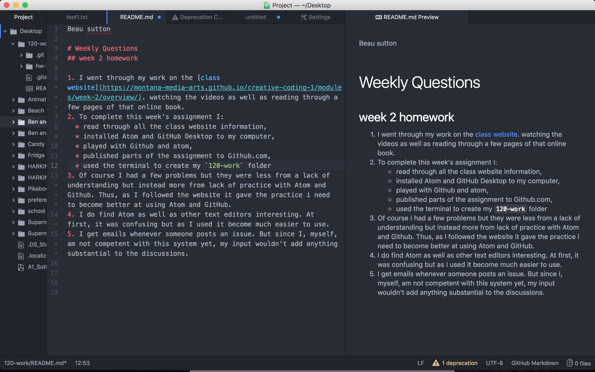

Beau sutton

# Weekly Questions
## week 2 homework

1. I went through my work on the [class website](https://montana-media-arts.github.io/creative-coding-1/modules/week-2/overview/). watching the videos as well as reading through a few pages of that online book.
2. To complete this week's assignment I:
  * read through all the class website information,
  * installed Atom and GitHub Desktop to my computer,
  * played with Github and atom,
  * published parts of the assignment to Github.com,
  * used the terminal to create my `120-work` folder
3. Of course I had a few problems but they were less from a lack of understanding but instead more from lack of practice with Atom and Github. Thus, as I followed the website it gave the practice i need to become better at using Atom and GitHub.
4. I do find Atom as well as other text editors interesting. At first, it was confusing but as I used it become much easier to use.
5. I get emails whenever someone posts an issue. But since I, myself, am not competent with this system yet, my input wouldn't add anything substantial to the discussions.

